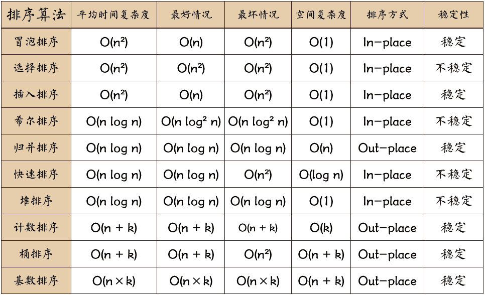

# 十大经典排序算法

排序算法是《数据结构与算法》中最基本的算法之一。

排序算法可以分为内部排序和外部排序，内部排序是数据记录在内存中进行排序，而外部排序是因排序的数据很大，一次不能容纳全部的排序记录，在排序过程中需要访问外存。常见的内部排序算法有：**插入排序、希尔排序、选择排序、冒泡排序、归并排序、快速排序、堆排序、基数排序**等。用一张图概括：

**关于时间复杂度**：

1. 平方阶 (O(n2)) 排序
	各类简单排序：直接插入、直接选择和冒泡排序。
2. 线性对数阶 (O(nlog2n)) 排序
	快速排序、堆排序和归并排序；
3. O(n1+§)) 排序，§ 是介于 0 和 1 之间的常数。
    希尔排序
4. 线性阶 (O(n)) 排序
	基数排序，此外还有桶、箱排序。

**关于稳定性**：

稳定的排序算法：冒泡排序、插入排序、归并排序和基数排序。

不是稳定的排序算法：选择排序、快速排序、希尔排序、堆排序。

**名词解释**：

**n**：数据规模

**k**：“桶”的个数

**In-place**：占用常数内存，不占用额外内存

**Out-place**：占用额外内存

**稳定性**：排序后 2 个相等键值的顺序和排序之前它们的顺序相同

----

**GitBook 内容大纲**

1. [冒泡排序](1.bubbleSort.md)
2. [选择排序](2.selectionSort.md)
3. [插入排序](3.insertionSort.md)
4. [希尔排序](4.shellSort.md)
5. [归并排序](5.mergeSort.md)
6. [快速排序](6.quickSort.md)
7. [堆排序](7.heapSort.md)
8. [计数排序](8.countingSort.md)
9. [桶排序](9.bucketSort.md)
10. [基数排序](10.radixSort.md)

----

本书内容几乎完全来源于网络。

开源项目地址：[https://github.com/hustcc/JS-Sorting-Algorithm](https://github.com/hustcc/JS-Sorting-Algorithm)，整理人 [hustcc](https://github.com/hustcc)。

GitBook 在线阅读地址：[https://sort.hust.cc/](https://sort.hust.cc/)。

本项目使用 [lint-md](https://github.com/hustcc/lint-md) 进行中文 Markdown 文件的格式检查，务必在提交 Pr 之前，保证 Markdown 格式正确。
